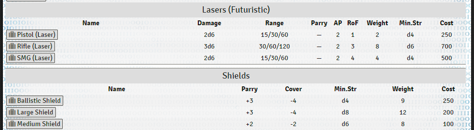
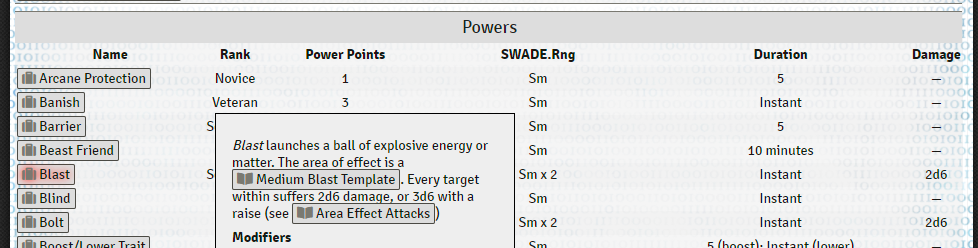
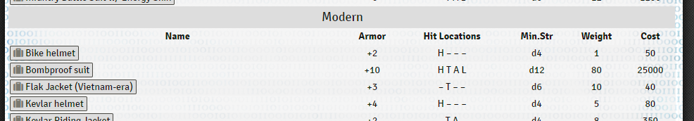

# Compendium summariser

This module gives you the ability to condense one or more Compendiums of Foundry Items down into a single quick-reference table in a JournalEntry. 

It can be useful for any system, but was written for Savage Worlds. Because Savage Worlds is a generic RPG system, playing it often involves navigating lists of gear, skills, etc spanning several books: the core rulebook, then the additions and subtractions made by your setting book, then any further additions from supplements or expansions. This can get awkward. 

With this module, you can produce a single, canonical reference for you and your players.

# Example screenshots







## Currently supported game systems

Right now, only [SWADE](https://gitlab.com/peginc/swade) is supported. However the bulk of the code has been written to be system agnostic and adding support for more systems should be as simple as writing some new Handlebars templates. If you're interested in contributing that, please let me know.

## Getting in touch / asking questions / giving feedback / reporting bugs

I am [docg#2827](https://discordapp.com/users/459741920370098176) on Discord. You can ping me in #swade on the [FoundryVTT Discord](https://discord.com/invite/v9K2hKJ). 

Alternatively, you can [file an issue in GitHub here](https://github.com/richardgaywood/foundry-penllawen-compendium-table-maker/issues). If you have something important I definitely shouldn't forget, this is the better way.

## How to use the module

The module currently has no UI and can only be used by writing macros.

**Wait, wtf, why?** Because this is a surprisingly difficult thing to write a UI for (there's a lot of overlapping options) and I quite honestly do not have time right now. I think the macro interface is good enough for a first release. I might revisit this decision in the future, but I am not making any promises. If you feel strongly that there should be a UI, this can be communicated to me in the form of pull requests that add one ;)

### The basics

Create a new macro and change the type to `script`. Then enter the following code:

```javascript
var s = game.modules.get("penllawen-compendium-table-maker").api.getCompendiumSummariser();

await s.makeNewJournalNamed("This is my Journal");

await s.addJournalPageNamed("Gear")
  .addInputCompendium("swade-core-rules.swade-equipment")
  .writeJournalPage();

await s.addJournalPageNamed("Skills")
  .addInputCompendium("swade-core-rules.swade-skills")
  .writeJournalPage();

s.showReport();
```

This will compile the SWADE core rules compendium of all Edges and Gear items into a single JournalEntry with two pages, one for each. Obviously, you can change the name of the output journal and pages, and the input Compendium as you please. Note that you need the full "pack name" of the Compendium, in other words `swade-core-rules.swade-edges` and not just `swade-edges`. 

`showReport()` at the end is optional but recommended. It'll pop up a litle dialog telling you what the module did.

Each time you run this script, it'll make a whole new JournalEntry, which will be in the world (ie. not inside a Compendium.) You can move it afterwards to wherever you like. Used like this, the module will never overwrite any data in any existing Journal.

### Combining multiple Compendiums into a single Journal Page

To do this, just add more `addInputCompendium(...)` lines:

```javascript
var s = game.modules.get("penllawen-compendium-table-maker")
    .api.getCompendiumSummariser();

await s.makeNewJournalNamed("This is my Journal for Deadlands");

await s.addJournalPageNamed("Deadlands Edges")
  .addInputCompendium("deadlands-core-rules.deadlands-edges")
  .addInputCompendium("swade-core-rules.swade-edges")
  .writeJournalPage();  

s.showReport();
```

You can add as many as you'd like of these. This is a great way to combine the items from core SWADE with the items from a setting like Deadlands.

## Renaming categories

You might want to change the names of categories in one of two Compendiums you are merging. For example, at the time of writing, the premium SWADE module has Edge categories of "Leadership", "Social", Combat", and so on. But the Deadlands module uses "Leadership Edge", "Social Edge", "Combat Edge" etc. This prevents the module from merging them.

By adding a renamer as shown below to one of the Compendiums, you can make the merge process work again. Here the Deadlands category "Combat Edge" will be renamed to "Combat", and then it will correctly merge with the SWADE Edges in the "Combat" category.

```
await s.addJournalPageNamed("edges")
  .enableDebug()
  .addInputCompendium("swade-core-rules.swade-edges")
  .addInputCompendium("deadlands-core-rules.deadlands-edges")
    .addCategoryRenamer("Background Edge", "Background")
    .addCategoryRenamer("Combat Edge", "Combat")
    .addCategoryRenamer("Legendary Edge", "Legendary")
    .addCategoryRenamer("Professional Edge", "Professional")
    .addCategoryRenamer("Social Edge", "Social")
    .addCategoryRenamer("Weird Edge", "Weird ")
  .writeJournalPage();
```

### Filtering items by name

Sometimes you want to say "take all of the items in this compendium except a few special ones." For example, in the Sprawlrunners setting, quite a few Edges from the core book are not available. You can do this like so:

```javascript
var s = game.modules.get("penllawen-compendium-table-maker")
    .api.getCompendiumSummariser();

await s.makeNewJournalNamed("This is my Journal for Sprawlrunners");

await s.addJournalPageNamed("Sprawlrunners Edges")
  .addInputCompendium("sprawl-core-rules.sprawlrunner-edges")
  .addInputCompendium("swade-core-rules.swade-edges")
    .addItemNameFilter("Arcane Background (Gifted)")  
    .addItemNameFilter("Arcane Background (Magic)")  
    .addItemNameFilter("Arcane Background (Miracles)")  
    .addItemNameFilter("Arcane Background (Psionics)")  
    .addItemNameFilter("Arcane Background (Weird Science)")  
    .addItemNameFilter("Aristocrat")  
    .addItemNameFilter("Rich")
    .addItemNameFilter("Filthy Rich")
    .addItemNameFilter("Artificer")
    .addItemNameFilter("Channeling")
    .addItemNameFilter("Concentration")
    .addItemNameFilter("Extra Effort")
    .addItemNameFilter("Gadgeteer")
    .addItemNameFilter("Holy/Unholy Warrior")
    .addItemNameFilter("Improved Rapid Recharge")
    .addItemNameFilter("Mentalist")
    .addItemNameFilter("Power Points")
    .addItemNameFilter("Power Surge")
    .addItemNameFilter("Rapid Recharge")
    .addItemNameFilter("Soul Drain")
    .addItemNameFilter("Wizard")
  .writeJournalPage();

s.showReport();
```

**Important Note**: The item name filtering is currently _case sensitive_. So if your item in Foundry is called "Filthy Rich" but you write "filthy rich" or even "Filthy rich" in your macro, it _will not filter successfully_. If in doubt, copy/paste the name directly from the item.

### Filtering items by type

Some of my houserule compendiums have gear of different types next to each other, for example I have guns and their ammunition in the same compendium. By default, this will produce a single JournalEntry with two tables in it - one for the weapons, one for the ammunition and other gear items. I can change this behaviour by adding a filter on item type:

```javascript
var s = game.modules.get("penllawen-compendium-table-maker").api.getCompendiumSummariser();

await s.makeNewJournalNamed("This is my Journal for houseruled items");

await s.addJournalPageNamed("Houserule weapons")
  .addInputCompendium("penllawen-sprawlrunners-extras.weapons")
      .addTypeNameFilter("gear")
  .writeJournalPage();

await s.addJournalPageNamed("Houserule ammo & gear")
  .addInputCompendium("penllawen-sprawlrunners-extras.weapons")
      .addTypeNameFilter("weapons")
  .writeJournalPage();

s.showReport();
```

Now I will get one Journal with two pages. One will contain only the weapons, the other only the gear.

## Extended example: Deadlands Edges & Hindrances

```javascript
var s = game.modules.get("penllawen-compendium-table-maker").api.getCompendiumSummariser();

await s.makeNewJournalNamed("Deadlands stuff");

await s.addJournalPageNamed("Deadlands Edges")
  .addInputCompendium("deadlands-core-rules.deadlands-edges")
  .addInputCompendium("swade-core-rules.swade-edges")
    .addItemNameFilter("Arcane Background (Gifted)")  
    .addItemNameFilter("Arcane Background (Magic)")  
    .addItemNameFilter("Arcane Background (Miracles)")  
    .addItemNameFilter("Arcane Background (Psionics)")  
    .addItemNameFilter("Arcane Background (Weird Science)")  
    .addItemNameFilter("Soul Drain")  
  .writeJournalPage();

await s.addJournalPageNamed("Deadlands Hindrances")
  .addInputCompendium("deadlands-core-rules.deadlands-hindrances")
  .addInputCompendium("swade-core-rules.swade-hindrances")
  .writeJournalPage();

s.showReport();
```

## Extended example: Sprawnlunners Edges

```javascript
var s = game.modules.get("penllawen-compendium-table-maker").api.getCompendiumSummariser();

await s.makeNewJournalNamed("Sprawlrunners stuff");

await s.addJournalPageNamed("Sprawlrunners Edges")
  .addInputCompendium("sprawl-core-rules.sprawlrunner-edges")
  .addInputCompendium("swade-core-rules.swade-edges")
    .addItemNameFilter("Arcane Background (Gifted)")  
    .addItemNameFilter("Arcane Background (Magic)")  
    .addItemNameFilter("Arcane Background (Miracles)")  
    .addItemNameFilter("Arcane Background (Psionics)")  
    .addItemNameFilter("Arcane Background (Weird Science)")  
    .addItemNameFilter("Aristocrat")  
    .addItemNameFilter("Rich")
    .addItemNameFilter("Filthy Rich")
    .addItemNameFilter("Artificer")
    .addItemNameFilter("Channeling")
    .addItemNameFilter("Concentration")
    .addItemNameFilter("Extra Effort")
    .addItemNameFilter("Gadgeteer")
    .addItemNameFilter("Holy/Unholy Warrior")
    .addItemNameFilter("Improved Rapid Recharge")
    .addItemNameFilter("Mentalist")
    .addItemNameFilter("Power Points")
    .addItemNameFilter("Power Surge")
    .addItemNameFilter("Rapid Recharge")
    .addItemNameFilter("Soul Drain")
    .addItemNameFilter("Wizard")
  .writeJournalPage();

s.showReport();
```